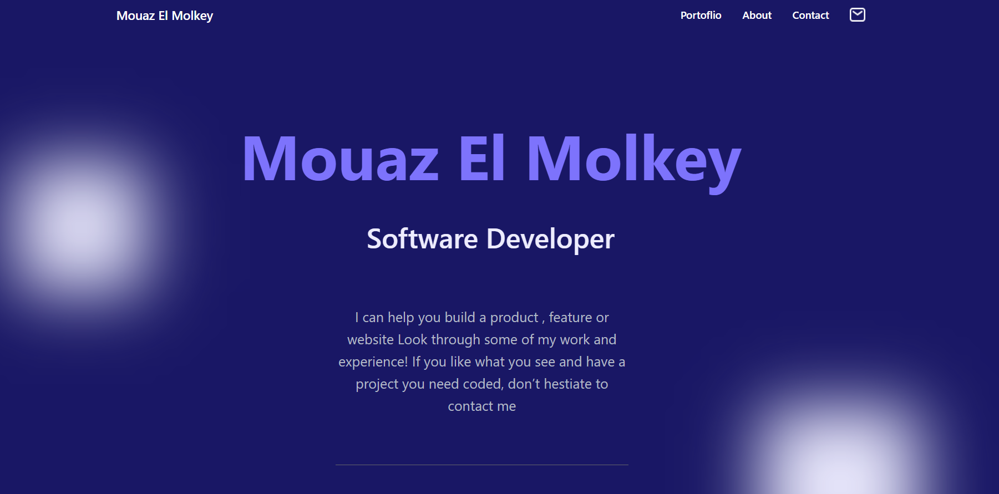
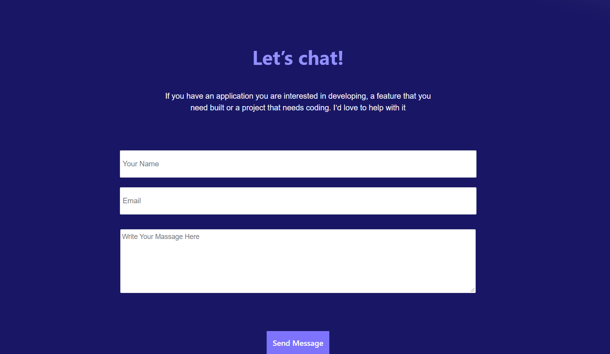

# Portfolio

> this is the My Portfolio Project .
> 
> 

## Getting Started

 [Live Demo](https://iammouaz.github.io/Portfolio/)
  
## Built With

- HTML
- CSS

## Getting Started

To get a local copy up and running follow these simple example steps.

1.Clone The Reop into your local : https://github.com/iammouaz/Portfolio.git

2. Open a commend line for same dirctionry of the project folder .

and you are ready to work on

## Authors

👤 **JustMe(Mouaz El Molkey)**

- GitHub: [@iammouaz](https://github.com/iammouaz)

## Show your support

Give a ⭐️ if you like this project!

## 📝 License

This project is [MIT](./MIT.md) licensed.